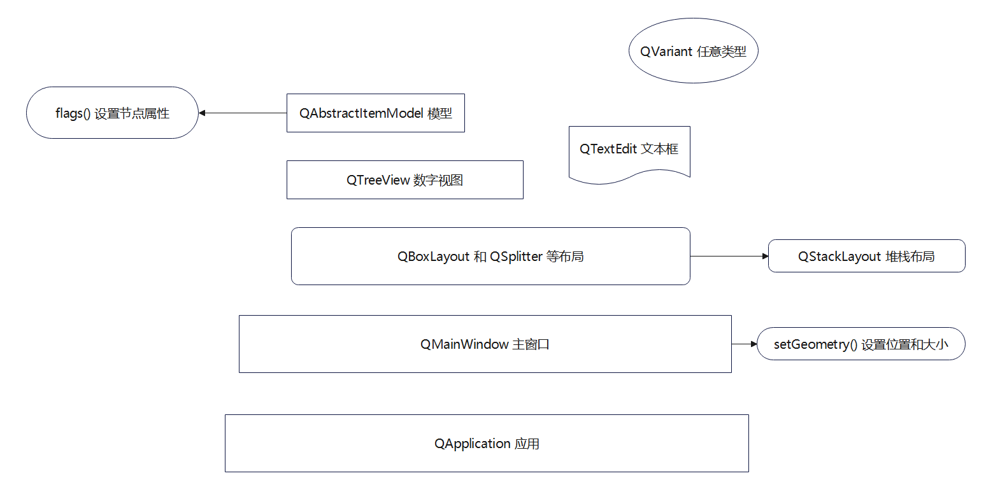

# 004-PyQt5 学习笔记

文章概览



## 一、QApplication 有哪些初始化方法，有哪些对象方法，有哪些属性？

`QApplication` 是 PyQt5 中用于创建图形界面应用程序的基础类。它是 `QObject` 的子类，主要用于管理应用程序的主事件循环以及窗口和小部件的创建。

### 初始化方法

`QApplication` 的主要构造函数用于初始化应用程序，常见的形式如下：

```python
app = QApplication(sys.argv)
```

这里 `sys.argv` 是命令行参数列表，它会被用来处理命令行选项，并且是所有基于 GUI 的应用程序的标准入口点。

### 对象方法

`QApplication` 提供了多种方法来控制应用程序的行为，以下是一些常用的方法：

- `exec_()`: 进入事件循环，等待直到最后一个窗口被关闭后退出。
- `quit()`: 退出事件循环。
- `aboutToQuit()`: 当应用程序即将退出时发出的信号。
- `processEvents()`: 处理事件队列中的事件。
- `addLibraryPath(path)`: 添加一个库搜索路径。
- `alert(widget, msec)`: 在给定的时间内使应用程序不可交互。
- `beep()`: 发出系统的“嘟嘟”声。
- `desktop()`: 返回一个指向 `QDesktopWidget` 的指针。
- `isLeftToRight()`, `isRightToLeft()`: 返回应用程序的方向。
- `setOverrideCursor(cursor)`, `restoreOverrideCursor()`: 设置覆盖光标。
- `setWindowIcon(icon)`: 设置应用程序图标。
- `topLevelWidgets()`: 返回顶级窗口的小部件列表。

### 属性

`QApplication` 类还具有一些属性，允许你获取或设置应用程序的状态或配置：

- `applicationName`: 应用程序名称。
- `applicationVersion`: 应用程序版本。
- `organizationName`: 组织名称。
- `organizationDomain`: 组织域名。
- `desktop`: 获取桌面的 `QDesktopWidget` 对象。
- `inputMethodQuery(query)`: 获取输入法相关的查询结果。
- `palette`: 获取应用程序的调色板。

除了上述方法和属性之外，`QApplication` 还提供了许多其他功能，例如剪贴板管理、键盘和鼠标事件处理等。具体的方法和属性可以根据 PyQt5 的官方文档来查看更详细的说明。当你使用 `QApplication` 时，通常会在程序开始时创建一个其实例，并在最后通过 `exec_()` 方法启动事件循环。

### 总结

常用方式如下：

```python
from PyQt5.QtWidgets import QApplication
import sys

if __name__ == '__main__':
    app = QApplication(sys.argv)
    sys.exit(app.exec_())
```

先用 sys.argv 来初始化，然后执行 exec_()进入循环世界等待解释。要开发的窗口处理函数将添加在这两个动作之间。

## 二、QMainWindow 有哪些初始化方法，有哪些对象方法，有哪些属性？

`QMainWindow` 是 PyQt5 中的一个核心窗口类，用于创建主应用程序窗口。它提供了一个包含菜单栏、工具栏、状态栏和中心区域的窗口框架。以下是 `QMainWindow` 的一些关键方面：

### 初始化方法

`QMainWindow` 的构造函数用于初始化一个主窗口对象：

```python
main_window = QMainWindow(parent=None, flags=Qt.WindowFlags())
```

其中 `parent` 是父级窗口，默认为 `None` 表示没有父级；`flags` 是窗口标志，通常使用默认值即可。

### 对象方法

`QMainWindow` 提供了许多方法来管理和操作主窗口的内容：

- `setCentralWidget(widget)`: 设置主窗口的中心部件。
- `centralWidget()`: 返回当前的中心部件。
- `addDockWidget(area, dock_widget)`: 向指定区域添加一个停靠窗口。
- `addToolBar(area, tool_bar)`: 向指定区域添加一个工具栏。
- `statusBar()`: 返回状态栏对象。
- `menuBar()`: 返回菜单栏对象。
- `setMenuBar(menu_bar)`: 设置菜单栏对象。
- `setStatusBar(status_bar)`: 设置状态栏对象。
- `setDockOptions(options)`: 设置停靠窗口选项。
- `closeEvent(event)`: 处理关闭事件。
- `resizeEvent(event)`: 处理重绘事件。
- `moveEvent(event)`: 处理移动事件。

### 属性

`QMainWindow` 的一些属性包括：

- `centralWidget`: 返回当前的中心部件。
- `menuBar`: 返回菜单栏。
- `statusBar`: 返回状态栏。
- `dockWidgetArea(dock_widget)`: 返回给定停靠窗口所在的区域。
- `allDockWidgets()`: 返回所有停靠窗口的列表。
- `activeWindow()`: 返回活动窗口。

### 示例

下面是一个简单的使用 `QMainWindow` 创建基本窗口的示例：

```python
from PyQt5.QtWidgets import QMainWindow, QApplication, QPushButton
import sys

class Example(QMainWindow):

    def __init__(self):
        super().__init__()

        self.initUI()

    def initUI(self):
        btn = QPushButton('Quit', self)
        btn.clicked.connect(QApplication.instance().quit)
        btn.resize(btn.sizeHint())
        btn.move(50, 50)

        self.statusBar().showMessage('Ready')
        self.setGeometry(300, 300, 350, 250)
        self.setWindowTitle('Main Window Example')
        self.show()

if __name__ == '__main__':
    app = QApplication(sys.argv)
    ex = Example()
    sys.exit(app.exec_())
```

这个示例创建了一个简单的主窗口，包含一个按钮和一个状态栏。当点击按钮时，应用程序会退出。

### 总结

QMainWindow 和 QApplication 类似，也是 QWidgets 的。主要使用方法是：

一、继承 QMainWindow，并在 init 中调用父类的 init 来初始化

二、自定义界面。创建一个函数在 init 的时候调用来初始化界面，包括添加按钮、设置状态、设置标题。

## 三、setGeometry 的含义是什么？

`setGeometry()` 方法是 PyQt5（以及更广泛的 Qt 框架）中的一个方法，用于设置窗口的位置和大小。这个方法被定义在 `QWidget` 类中，而 `QMainWindow` 继承自 `QWidget`，因此也可以使用这个方法。

`setGeometry()` 方法的基本语法如下：

```python
def setGeometry(self, x, y, width, height)
```

这里的参数说明如下：

- `x`：窗口左上角距离屏幕左侧边缘的水平位置（以像素为单位）。
- `y`：窗口左上角距离屏幕顶部边缘的垂直位置（以像素为单位）。
- `width`：窗口的宽度（以像素为单位）。
- `height`：窗口的高度（以像素为单位）。

### 使用示例

假设你想创建一个窗口，使其位于屏幕的 (300, 300) 位置，并且窗口的大小为宽 250 像素，高 150 像素，你可以这样设置：

```python
window = QMainWindow()
window.setGeometry(300, 300, 250, 150)
```

### 注意事项

- `setGeometry()` 只影响窗口内部的大小和位置，而不是整个窗口装饰部分（如标题栏、边框等）。
- 如果你的应用运行在多显示器环境中，确保你选择的坐标 `(x, y)` 不会导致窗口的一部分出现在屏幕之外。
- 如果你在设置几何位置之后想要确保窗口立即显示这些更改，可以调用 `show()` 方法。

### 相关方法

除了 `setGeometry()` 之外，还有一些其他的方法可以帮助你管理窗口的位置和大小：

- `geometry()`：获取窗口的当前几何位置和大小。
- `move(x, y)`：只改变窗口的位置而不改变其大小。
- `resize(width, height)`：只改变窗口的大小而不改变其位置。

这些方法可以结合起来使用，帮助你更好地控制和调整窗口的外观。

### 总结

setGeometry 是一个通用的函数，很多 PyQt5 里面的组件都能使用这个函数来设置组件位置和大小。

## 四、QTreeView 怎么使用

`QTreeView` 是 PyQt5 中用于显示树形结构数据的组件。它通常与 `QAbstractItemModel` 的具体实现一起使用，如 `QStandardItemModel`，来展示和编辑分层的数据。

下面是一个简单的例子，演示如何使用 `QTreeView` 来展示一个简单的树形结构：

### 创建模型

首先，我们需要创建一个模型来存储数据。`QStandardItemModel` 是一个常用的模型，它可以方便地添加和操作树状数据。

```python
from PyQt5.QtWidgets import QApplication, QTreeView
from PyQt5.QtGui import QStandardItemModel, QStandardItem
import sys

app = QApplication(sys.argv)

# 创建一个模型
model = QStandardItemModel()
model.setHorizontalHeaderLabels(["Name", "Value"])  # 设置列标题

# 添加一些数据
root_item = model.invisibleRootItem()
item0 = QStandardItem("Item 0")
item0.appendRow(QStandardItem("Child 0"))
item0.appendRow(QStandardItem("Child 1"))
root_item.appendRow(item0)

item1 = QStandardItem("Item 1")
item1.appendRow(QStandardItem("Child 0"))
item1.appendRow(QStandardItem("Child 1"))
root_item.appendRow(item1)

# 设置第二列的值
item0.child(0).appendRow(QStandardItem("Value 0"))
item0.child(1).appendRow(QStandardItem("Value 1"))
item1.child(0).appendRow(QStandardItem("Value 0"))
item1.child(1).appendRow(QStandardItem("Value 1"))
```

### 创建视图

然后，我们创建一个 `QTreeView` 并将其设置为使用上面创建的模型：

```python
# 创建一个视图
view = QTreeView()
view.setModel(model)
view.setWindowTitle("Simple Tree View")

# 显示视图
view.show()
```

### 执行应用

最后，我们需要启动应用程序的事件循环：

```python
sys.exit(app.exec_())
```

### 完整代码

将上述代码片段组合在一起，形成一个完整的 Python 程序：

```python
from PyQt5.QtWidgets import QApplication, QTreeView
from PyQt5.QtGui import QStandardItemModel, QStandardItem
import sys

def main():
    app = QApplication(sys.argv)

    _# 创建一个模型_
    model = QStandardItemModel()
    model.setHorizontalHeaderLabels(["Name", "Value"])

    _# 添加一些数据_
    root_item = model.invisibleRootItem()
    item0 = QStandardItem("Item 0")
    item0.appendRow(QStandardItem("Child 0"))
    item0.appendRow(QStandardItem("Child 1"))
    root_item.appendRow(item0)

    item1 = QStandardItem("Item 1")
    item1.appendRow(QStandardItem("Child 0"))
    item1.appendRow(QStandardItem("Child 1"))
    root_item.appendRow(item1)

    _# 设置第二列的值_
    item0.child(0).appendRow(QStandardItem("Value 0"))
    item0.child(1).appendRow(QStandardItem("Value 1"))
    item1.child(0).appendRow(QStandardItem("Value 0"))
    item1.child(1).appendRow(QStandardItem("Value 1"))

    _# 创建一个视图_
    view = QTreeView()
    view.setModel(model)
    view.setWindowTitle("Simple Tree View")

    _# 显示视图_
    view.show()

    _# 启动应用程序的事件循环_
    sys.exit(app.exec_())

if __name__ == '__main__':
    main()
```

这段代码创建了一个简单的树形视图，并展示了如何使用 `QTreeView` 和 `QStandardItemModel` 来显示分层数据。你可以根据需要扩展这个例子，添加更多功能，如响应用户的交互行为、排序、过滤等。

运行结果如下：


### 总结

一、总的采用了 MVC（模型、视图、控制）的结构

二、创建 QStandardItemModel 的模型对象，使用 appendRow 方法来为模型添加数据

三、创建 QTreeView 对象，用 setModel 来显示模型

四、如果添加控制，则给 QTreeView 添加点击信号处理，即可完成控制

## 五、如何通过 QAbstractItemModel 定制模型呢？

`QAbstractItemModel` 是一个抽象基类，用于表示树形结构的数据模型。它定义了一组接口，允许视图组件（如 `QTreeView`）与数据模型进行交互。要创建一个自定义的模型，您需要继承 `QAbstractItemModel` 并实现其必要的方法。

下面是一个简单的示例，展示了如何创建一个自定义的 `QAbstractItemModel` 子类，并将其与 `QTreeView` 结合使用。

### 解释

1. `CustomTreeModel`: 这个类继承自 `QAbstractItemModel`，并实现了必须的方法。
2. `setupModelData`: 初始化模型数据。
3. `rowCount`: 返回指定父项下的子项数量。
4. `columnCount`: 返回每行的列数。
5. `data`: 返回索引处的数据。
6. `flag`: 返回数据状态，包括：是否可选、可编辑、是否使能等。
7. `headerData`: 返回表头数据。
8. `index`: 创建一个索引。
9. `parent`: 返回索引的父项。
10. `insertRows`: 插入多行。

```python
import sys
from PyQt5.QtWidgets import QApplication, QMainWindow, QVBoxLayout, QHBoxLayout, QTreeView, QTextEdit, QPushButton, QSplitter, QWidget
from PyQt5.QtCore import Qt, QModelIndex, QVariant, QAbstractItemModel
import os
import base64
import fitz  _# PyMuPDF_
from PyQt5.QtWidgets import QApplication, QTextEdit, QVBoxLayout, QWidget
from PyQt5.QtGui import QFont, QPixmap, QTextCharFormat, QTextCursor, QBrush, QColor
from PyQt5.QtGui import QFont, QTextImageFormat, QWheelEvent, QImage, QPixmap, QIcon
import hashlib
import copy
import subprocess
import time

class CustomTreeItem:
    def __init__(self, name, value=None, parent=None):
        self.name = name
        self.value = value
        self.children = []
        self.parent_item = parent

    def appendChild(self, item):
        self.children.append(item)

    def child(self, row):
        return self.children[row]

    def childCount(self):
        return len(self.children)

    def columnCount(self):
        return 1

    def data(self, column):
        if column == 0:
            return self.name
        return None

    def parent(self):
        return self.parent_item

    def row(self):
        if self.parent_item:
            return self.parent_item.children.index(self)
        return 0

class CustomTreeModel(QAbstractItemModel):
    def __init__(self, data, root_name, parent=None):
        super(CustomTreeModel, self).__init__(parent)
        self.root_name = root_name
        
        
        self.rootItem = CustomTreeItem('root')
        self.setupModelData(data, self.rootItem)

    def setupModelData(self, data, parent):
        for key, value in data.items():
            if isinstance(value, dict):
                item = CustomTreeItem(key, parent=parent)
                parent.appendChild(item)
                self.setupModelData(value, item)
            else:
                item = CustomTreeItem(key, value=value, parent=parent)
                parent.appendChild(item)

    def rowCount(self, parent=QModelIndex()):
        if not parent.isValid():
            parentItem = self.rootItem
        else:
            parentItem = parent.internalPointer()
        return parentItem.childCount()
 
    def columnCount(self, parent=QModelIndex()):
        return 1

    def data(self, index, role=Qt.DisplayRole):
        if not index.isValid():
            return QVariant()
        if role != Qt.DisplayRole:
            return QVariant()
        item = index.internalPointer()
        return item.data(0)

    def flags(self, index):
        return Qt.ItemIsEnabled | Qt.ItemIsSelectable

    def headerData(self, section, orientation, role):
        if orientation == Qt.Horizontal and role == Qt.DisplayRole:
            _# return "Custom Tree"_
            return self.root_name
        return QVariant()

    def index(self, row, column, parent=QModelIndex()):
        if not self.hasIndex(row, column, parent):
            return QModelIndex()
        if not parent.isValid():
            parentItem = self.rootItem
        else:
            parentItem = parent.internalPointer()
        childItem = parentItem.child(row)
        if childItem:
            return self.createIndex(row, column, childItem)
        else:
            return QModelIndex()

    def parent(self, index):
        if not index.isValid():
            return QModelIndex()
        childItem = index.internalPointer()
        parentItem = childItem.parent()
        if parentItem == self.rootItem:
            return QModelIndex()
        return self.createIndex(parentItem.row(), 0, parentItem)

    def insertRows(self, position, rows, parent=QModelIndex()):
        self.beginInsertRows(parent, position, position + rows - 1)
        if not parent.isValid():
            parentItem = self.rootItem
        else:
            parentItem = parent.internalPointer()
        for row in range(rows):
            item = CustomTreeItem(f"New Row {position + row}", parent=parentItem)
            parentItem.appendChild(item)
        self.endInsertRows()
        return True

class MyWindow(QMainWindow):
    def __init__(self) -> None:
        super().__init__()
        self.initUI()
    
    def initUI(self):
        my_dict = {
            "hello": "world",
            "python": {
                "PyQt5": {
                    "QApplication": "1",
                    "QMainWindow": "2",
                    "QTreeView": "3",
                    "QAbstractItemModel": "4"
                },
                "fitz": "PyMuPDF"
            }
        }
        model = CustomTreeModel(my_dict, "my_dict")
        viewer = QTreeView()
        viewer.setModel(model)
        _# viewer.show() # 通过MyWindow的SetCentraWidget自动显示_
        self.setCentralWidget(viewer)
        self.setWindowTitle("QMainWindow with QTreeView")
        self.setGeometry(100, 100, 800, 800)
        _# self.show() # 在MyWindow初始化之后 show_

if __name__ == "__main__":
    app = QApplication(sys.argv)
    win = MyWindow()
    win.show()
    sys.exit(app.exec_())
```

### 总结

一、创建一个类 CustomTreeModel，继承自 QAbstractItemModel，重写部分回调函数，从而实现定时模型

二、定义一个 CustomTreeItem 来保持每个 Item 关系，并提供方法，供 CustomTreeModel 调用

三、其他 QTreeView 的使用不变

## 六、自定义模型的 flags 函数有何作用，什么时候被调用的呢？

在自定义的 `QAbstractItemModel` 子类中，`flags` 函数是一个重要的方法，它用于确定模型中的项是否支持某些操作，如选择、编辑、拖放等。`flags` 函数通常在视图组件请求项的属性时被调用，以便确定项的可用性。

### `flags` 函数的作用

`flags` 函数返回一个 `Qt.ItemFlag` 的组合，这些标志位决定了项的哪些特性是可以启用的。常见的 `Qt.ItemFlag` 包括：

- `Qt.ItemIsEnabled`: 项是否可以被启用。
- `Qt.ItemIsSelectable`: 项是否可以被选中。
- `Qt.ItemIsEditable`: 项是否可以被编辑。
- `Qt.ItemIsDragEnabled`: 项是否可以被拖动。
- `Qt.ItemIsDropEnabled`: 项是否可以接受拖放操作。
- `Qt.ItemIsUserCheckable`: 项是否可以被用户检查（例如复选框）。
- `Qt.ItemIsTristate`: 项是否支持三态（未选中、选中、半选中）。

### `flags` 函数的实现

在自定义模型中，`flags` 函数通常如下实现：

```python
from PyQt5.QtCore import Qt, QAbstractItemModel, QModelIndex

class CustomTreeModel(QAbstractItemModel):
    def flags(self, index):
        if not index.isValid():
            return Qt.NoItemFlags

        # 默认情况下，我们可以使项可选和可编辑
        return Qt.ItemIsEnabled | Qt.ItemIsSelectable | Qt.ItemIsEditable
```

### `flags` 函数的调用时机

`flags` 函数通常在以下情况下被调用：

1. **初始化视图时**：当视图组件首次加载模型时，会调用 `flags` 函数来确定项的属性。
2. **项的状态变化时**：当模型中的项的状态发生变化时，视图可能会重新调用 `flags` 函数来更新项的属性。
3. **响应用户交互时**：例如，当用户尝试选择一个项时，视图会调用 `flags` 函数来检查该项是否可选。

### 示例代码

下面是一个完整的示例，展示了如何在自定义模型中实现 `flags` 函数，并将其与 `QTreeView` 结合使用：

```python
from PyQt5.QtCore import Qt, QModelIndex, QAbstractItemModel, QVariant
from PyQt5.QtWidgets import QApplication, QMainWindow, QTreeView
import sys

class CustomTreeModel(QAbstractItemModel):
    def __init__(self, parent=None):
        super(CustomTreeModel, self).__init__(parent)
        self.rootItem = {"name": "root", "children": []}
        self.setupModelData()

    def setupModelData(self):
        self.rootItem["children"].append({"name": "Item 1", "children": [
            {"name": "Child 1"},
            {"name": "Child 2"}
        ]})
        self.rootItem["children"].append({"name": "Item 2", "children": [
            {"name": "Child 3"},
            {"name": "Child 4"}
        ]})

    def rowCount(self, parent=QModelIndex()):
        if not parent.isValid():
            return len(self.rootItem["children"])
        else:
            parentItem = parent.internalPointer()
            if parentItem is not None:
                return len(parentItem["children"])
            return 0

    def columnCount(self, parent=QModelIndex()):
        return 1  # 每个项只有一列

    def data(self, index, role=Qt.DisplayRole):
        if not index.isValid():
            return QVariant()
        if role != Qt.DisplayRole:
            return QVariant()
        item = index.internalPointer()
        return QVariant(item["name"])

    def headerData(self, section, orientation, role):
        if orientation == Qt.Horizontal and role == Qt.DisplayRole:
            return QVariant("Name")
        return QVariant()

    def index(self, row, column, parent=QModelIndex()):
        if not self.hasIndex(row, column, parent):
            return QModelIndex()

        if not parent.isValid():
            return self.createIndex(row, column, self.rootItem["children"][row])
        else:
            parentItem = parent.internalPointer()
            childItem = parentItem["children"][row]
            if childItem:
                return self.createIndex(row, column, childItem)
        return QModelIndex()

    def parent(self, index):
        if not index.isValid():
            return QModelIndex()

        childItem = index.internalPointer()
        parentItem = self.findParent(childItem)
        if parentItem == self.rootItem:
            return QModelIndex()

        return self.createIndex(parentItem["children"].index(childItem), 0, parentItem)

    def findParent(self, childItem):
        for item in self.rootItem["children"]:
            found = self.findInChildren(item, childItem)
            if found is not None:
                return found
        return self.rootItem

    def findInChildren(self, item, childItem):
        if item == childItem:
            return self.rootItem
        for child in item["children"]:
            if child == childItem:
                return item
            result = self.findInChildren(child, childItem)
            if result is not None:
                return result
        return None

    def flags(self, index):
        if not index.isValid():
            return Qt.NoItemFlags

        # 默认情况下，我们可以使项可选和可编辑
        return Qt.ItemIsEnabled | Qt.ItemIsSelectable | Qt.ItemIsEditable

class MainWindow(QMainWindow):
    def __init__(self):
        super(MainWindow, self).__init__()

        # 创建一个 QTreeView 实例
        self.tree_view = QTreeView()

        # 创建一个 CustomTreeModel 实例
        self.model = CustomTreeModel()

        # 将模型设置到 QTreeView 中
        self.tree_view.setModel(self.model)

        # 将 QTreeView 设置为主窗口的中心部件
        self.setCentralWidget(self.tree_view)

        # 设置窗口标题
        self.setWindowTitle("QMainWindow with Custom TreeView")

def main():
    app = QApplication(sys.argv)

    # 创建一个 QMainWindow 实例
    window = MainWindow()
    window.show()

    # 启动应用程序的事件循环
    sys.exit(app.exec_())

if __name__ == '__main__':
    main()
```

### 代码解释

1. **CustomTreeModel**** 类**：自定义模型类，实现了 `QAbstractItemModel` 接口。
2. **flags**** 方法**：返回项的标志位，使项可选和可编辑。
3. **MainWindow**** 类**：创建一个 `QMainWindow`，并在其中设置 `QTreeView` 和自定义模型。

通过这个示例，你可以看到如何在自定义模型中实现 `flags` 方法，并将其与 `QTreeView` 结合使用。你可以根据需要修改和扩展这个示例，以适应不同的应用场景。

## 七、QVariant 是什么？怎么使用？

`QVariant` 是 Qt 框架中的一个类型安全的容器类，用于存储任意类型的数据。`QVariant` 支持多种基础数据类型，包括整型、浮点型、字符串、列表、字典等，以及 Qt 中的一些特定类型，如 `QDate`、`QTime`、`QDateTime`、`QPoint`、`QSize`、`QRect` 等。

### 为什么使用 `QVariant`？

1. **类型安全**：`QVariant` 可以存储不同类型的值，但在读取时会自动转换为所需的类型。
2. **灵活性**：`QVariant` 允许在不知道具体类型的情况下传递数据，使得代码更加灵活。
3. **Qt 的集成**：许多 Qt 类和函数使用 `QVariant` 作为参数或返回值，特别是在信号和槽机制中。

### `QVariant` 的基本使用

#### 创建 `QVariant` 对象

创建一个 `QVariant` 对象很简单，可以直接传入相应的值：

```python
from PyQt5.QtCore import QVariant

# 创建不同类型的 QVariant 对象
variant_int = QVariant(42)
variant_str = QVariant("Hello, World!")
variant_list = QVariant([1, 2, 3])
variant_dict = QVariant({"key": "value"})
```

#### 访问 `QVariant` 的值

访问 `QVariant` 的值时，需要指定期望的类型。如果类型匹配，则返回转换后的值；如果不匹配，则返回默认值或引发异常。

```python
# 访问 QVariant 的值
value_int = variant_int.toInt()[0]  # 使用 toInt() 方法，返回一个元组 (value, ok)
value_str = variant_str.toString()  # 使用 toString() 方法
value_list = variant_list.toList()  # 使用 toList() 方法
value_dict = variant_dict.toPyObject()  # 使用 toPyObject() 方法
```

在 PyQt5 中，`toPyObject()` 方法可以将 `QVariant` 转换为 Python 的原生类型，这在处理字典、列表等复杂数据结构时特别有用。

#### `QVariant` 的常用方法

`QVariant` 提供了一些常用的方法来处理存储的数据：

- `isNull()`: 判断 `QVariant` 是否为空。
- `canConvert(type)`: 判断 `QVariant` 是否可以转换为指定类型。
- `toInt()`, `toDouble()`, `toString()`, `toList()`, `toMap()`, `toByteArray()`, `toBool()`, `toUrl()`, `toRect()`, `toSize()`, `toPoint()`, `toDateTime()`, `toDate()`, `toTime()`, `toPyObject()`: 将 `QVariant` 转换为相应类型。
- `type()`: 返回 `QVariant` 的类型。

### 示例代码

下面是一个简单的示例，展示了如何使用 `QVariant`：

```python
from PyQt5.QtCore import QVariant, Qt

# 创建 QVariant 对象
variant_int = QVariant(42)
variant_str = QVariant("Hello, World!")
variant_list = QVariant([1, 2, 3])
variant_dict = QVariant({"key": "value"})

# 访问 QVariant 的值
value_int = variant_int.toInt()[0]
value_str = variant_str.toString()
value_list = variant_list.toList()
value_dict = variant_dict.toPyObject()

print("Integer:", value_int)
print("String:", value_str)
print("List:", value_list)
print("Dictionary:", value_dict)

# 检查 QVariant 是否为空
print("Is variant_int null?", variant_int.isNull())

# 检查是否可以转换为整型
print("Can convert variant_str to int?", variant_str.canConvert(int))

# 转换为整型
converted_int, ok = variant_str.toInt()
print("Converted int:", converted_int, "OK:", ok)  # 由于类型不匹配，ok 为 False

# 获取 QVariant 的类型
print("Type of variant_int:", variant_int.type())
```

## 八、在模型中使用 `QVariant`

在 Qt 的模型（如 `QAbstractItemModel`）中，`QVariant` 经常用于存储和传递数据。例如，在 `data` 方法中，通常返回一个 `QVariant`：

```python
from PyQt5.QtCore import Qt, QModelIndex, QAbstractItemModel, QVariant

class CustomTreeModel(QAbstractItemModel):
    def __init__(self, parent=None):
        super(CustomTreeModel, self).__init__(parent)
        # 初始化模型数据...

    def data(self, index, role=Qt.DisplayRole):
        if not index.isValid():
            return QVariant()
        if role != Qt.DisplayRole:
            return QVariant()
        item = index.internalPointer()
        return QVariant(item["name"])
```

在这个例子中，`data` 方法返回一个 `QVariant`，其中包含了索引处的数据。这样做可以让视图组件（如 `QTreeView`）更容易处理数据，并且保持类型的安全性。

通过使用 `QVariant`，您可以轻松地在模型和视图之间传递不同类型的数据，并且在需要的时候转换成合适的类型。

## 九、QVBoxLayout 和 QSplitter 有什么区别，还有哪些布局？

`QVBoxLayout` 和 `QSplitter` 都是 Qt 中用来管理和组织控件的布局管理器，但它们的工作方式和用途有所不同。此外，Qt 还提供了多种其他的布局管理器，每种都有其特定的应用场景。

### QVBoxLayout

`QVBoxLayout` 是一个垂直布局管理器，它将控件按照垂直方向排列。你可以向 `QVBoxLayout` 中添加多个控件，这些控件将会依次上下堆叠。`QVBoxLayout` 还可以设置控件之间的间距、边距等属性。

#### 示例

```python
from PyQt5.QtWidgets import QApplication, QWidget, QVBoxLayout, QPushButton

app = QApplication([])

# 创建一个窗口
window = QWidget()

# 创建一个 QVBoxLayout
layout = QVBoxLayout()

# 向布局中添加按钮
button1 = QPushButton("Button 1")
button2 = QPushButton("Button 2")
button3 = QPushButton("Button 3")

layout.addWidget(button1)
layout.addWidget(button2)
layout.addWidget(button3)

# 将布局设置为窗口的布局
window.setLayout(layout)

# 显示窗口
window.show()

# 启动应用程序的事件循环
sys.exit(app.exec_())
```

### QSplitter

`QSplitter` 是一个分割器，它可以用来创建一个可以动态调整大小的布局。`QSplitter` 可以包含多个子窗口，每个子窗口可以是一个控件或其他布局。用户可以通过拖动分割器的手柄来调整各个子窗口的大小。

#### 示例

```python
from PyQt5.QtWidgets import QApplication, QWidget, QVBoxLayout, QPushButton, QSplitter

app = QApplication([])

# 创建一个窗口
window = QWidget()

# 创建一个 QSplitter
splitter = QSplitter()

# 创建一些按钮
button1 = QPushButton("Button 1")
button2 = QPushButton("Button 2")
button3 = QPushButton("Button 3")

# 将按钮添加到分割器中
splitter.addWidget(button1)
splitter.addWidget(button2)
splitter.addWidget(button3)

# 创建一个 QVBoxLayout 并将分割器添加到布局中
layout = QVBoxLayout()
layout.addWidget(splitter)

# 将布局设置为窗口的布局
window.setLayout(layout)

# 显示窗口
window.show()

# 启动应用程序的事件循环
sys.exit(app.exec_())
```

### 其他布局管理器

Qt 提供了多种布局管理器，除了 `QVBoxLayout` 和 `QSplitter` 之外，还包括：

1. **QHBoxLayout**：水平布局管理器，将控件按水平方向排列。
2. **QGridLayout**：网格布局管理器，将控件放置在一个二维网格中。
3. **QFormLayout**：表单布局管理器，适用于创建表单界面。
4. **QStackedLayout**：堆栈布局管理器，用于切换显示不同的控件。
5. **QTabWidget**：选项卡布局管理器，用于创建带有选项卡的界面。

#### 示例：其他布局管理器

##### QHBoxLayout

```python
from PyQt5.QtWidgets import QApplication, QWidget, QHBoxLayout, QPushButton

app = QApplication([])

# 创建一个窗口
window = QWidget()

# 创建一个 QHBoxLayout
layout = QHBoxLayout()

# 向布局中添加按钮
button1 = QPushButton("Button 1")
button2 = QPushButton("Button 2")
button3 = QPushButton("Button 3")

layout.addWidget(button1)
layout.addWidget(button2)
layout.addWidget(button3)

# 将布局设置为窗口的布局
window.setLayout(layout)

# 显示窗口
window.show()

# 启动应用程序的事件循环
sys.exit(app.exec_())
```

##### QGridLayout

```python
from PyQt5.QtWidgets import QApplication, QWidget, QGridLayout, QPushButton

app = QApplication([])

# 创建一个窗口
window = QWidget()

# 创建一个 QGridLayout
layout = QGridLayout()

# 向布局中添加按钮
button1 = QPushButton("Button 1")
button2 = QPushButton("Button 2")
button3 = QPushButton("Button 3")
button4 = QPushButton("Button 4")

layout.addWidget(button1, 0, 0)
layout.addWidget(button2, 0, 1)
layout.addWidget(button3, 1, 0)
layout.addWidget(button4, 1, 1)

# 将布局设置为窗口的布局
window.setLayout(layout)

# 显示窗口
window.show()

# 启动应用程序的事件循环
sys.exit(app.exec_())
```

##### QFormLayout

```python
from PyQt5.QtWidgets import QApplication, QWidget, QFormLayout, QLabel, QLineEdit

app = QApplication([])

# 创建一个窗口
window = QWidget()

# 创建一个 QFormLayout
layout = QFormLayout()

# 向布局中添加标签和输入框
label1 = QLabel("Label 1")
lineedit1 = QLineEdit()
label2 = QLabel("Label 2")
lineedit2 = QLineEdit()

layout.addRow(label1, lineedit1)
layout.addRow(label2, lineedit2)

# 将布局设置为窗口的布局
window.setLayout(layout)

# 显示窗口
window.show()

# 启动应用程序的事件循环
sys.exit(app.exec_())
```

##### QStackedLayout

```python
from PyQt5.QtWidgets import QApplication, QWidget, QStackedLayout, QPushButton

app = QApplication([])

# 创建一个窗口
window = QWidget()

# 创建一个 QStackedLayout
layout = QStackedLayout()

# 创建一些页面
page1 = QWidget()
page2 = QWidget()

# 设置页面的布局
layout_page1 = QVBoxLayout()
layout_page1.addWidget(QPushButton("Page 1 Button"))
page1.setLayout(layout_page1)

layout_page2 = QVBoxLayout()
layout_page2.addWidget(QPushButton("Page 2 Button"))
page2.setLayout(layout_page2)

# 将页面添加到堆栈布局中
layout.addWidget(page1)
layout.addWidget(page2)

# 将堆栈布局设置为窗口的布局
window.setLayout(layout)

# 显示窗口
window.show()

# 启动应用程序的事件循环
sys.exit(app.exec_())
```

### 总结

- **QVBoxLayout**：用于垂直排列控件。
- **QSplitter**：用于创建可以动态调整大小的布局。
- **QHBoxLayout**：用于水平排列控件。
- **QGridLayout**：用于创建网格布局。
- **QFormLayout**：用于创建表单布局。
- **QStackedLayout**：用于创建堆栈布局。
- **QTabWidget**：用于创建带选项卡的布局。

根据您的具体需求选择合适的布局管理器，可以有效地管理和组织控件，使界面更加美观和易于维护。

一、使用上，创建一个布局对象，然后通过 addWidget 来往布局里面放入对象

二、组合布局的时候，创建一个大的布局对象，然后把小的布局对象通过 addWidget 的方式添加进去

三、在 QMainWindow 对象，使用 setCentralWidget 的方式与主窗口关联

## 十、QStackedLayout 展开讲讲

`QStackedLayout` 是 Qt 中的一个布局管理器，它用于管理一组控件，并且一次只显示其中一个控件。这种布局非常适合用于创建多页面或多标签的用户界面，其中每个页面或标签对应一个控件。用户可以通过更改当前索引来切换显示的控件。

### QStackedLayout 的特点

1. **单一可见控件**：在任何时候只有一个控件是可见的。
2. **控件堆栈**：所有添加到 `QStackedLayout` 的控件都会被存储在一个堆栈中，你可以通过索引来选择显示哪个控件。
3. **动态切换**：可以根据用户的操作或程序逻辑动态地切换当前显示的控件。

### 使用 QStackedLayout 的步骤

1. **创建 QStackedLayout 实例**。
2. **向布局中添加控件**。
3. **设置当前索引**，以决定显示哪一个控件。

### 示例代码

下面是一个简单的示例，展示了如何使用 `QStackedLayout` 创建一个多页面的界面：

```python
from PyQt5.QtWidgets import QApplication, QWidget, QVBoxLayout, QStackedLayout, QPushButton, QLabel

import sys

class MultiPageApp(QWidget):
    def __init__(self):
        super(MultiPageApp, self).__init__()

        # 创建一个 QVBoxLayout 作为主布局
        main_layout = QVBoxLayout(self)

        # 创建一个 QStackedLayout
        self.stacked_layout = QStackedLayout()

        # 创建几个页面
        self.page1 = QWidget()
        self.page2 = QWidget()
        self.page3 = QWidget()

        # 为每个页面设置布局
        layout1 = QVBoxLayout()
        layout1.addWidget(QLabel("This is Page 1"))
        self.page1.setLayout(layout1)

        layout2 = QVBoxLayout()
        layout2.addWidget(QLabel("This is Page 2"))
        self.page2.setLayout(layout2)

        layout3 = QVBoxLayout()
        layout3.addWidget(QLabel("This is Page 3"))
        self.page3.setLayout(layout3)

        # 将页面添加到堆栈布局中
        self.stacked_layout.addWidget(self.page1)
        self.stacked_layout.addWidget(self.page2)
        self.stacked_layout.addWidget(self.page3)

        # 创建一个按钮布局
        button_layout = QVBoxLayout()
        button1 = QPushButton("Page 1")
        button2 = QPushButton("Page 2")
        button3 = QPushButton("Page 3")

        # 连接按钮信号到槽函数
        button1.clicked.connect(lambda: self.stacked_layout.setCurrentIndex(0))
        button2.clicked.connect(lambda: self.stacked_layout.setCurrentIndex(1))
        button3.clicked.connect(lambda: self.stacked_layout.setCurrentIndex(2))

        button_layout.addWidget(button1)
        button_layout.addWidget(button2)
        button_layout.addWidget(button3)

        # 将堆栈布局和按钮布局添加到主布局中
        main_layout.addLayout(button_layout)
        main_layout.addLayout(self.stacked_layout)

        # 设置窗口标题
        self.setWindowTitle("Multi-Page App with QStackedLayout")

def main():
    app = QApplication(sys.argv)

    # 创建一个 MultiPageApp 实例
    app_instance = MultiPageApp()
    app_instance.show()

    # 启动应用程序的事件循环
    sys.exit(app.exec_())

if __name__ == '__main__':
    main()
```

### 代码解释

1. **创建 ****QStackedLayout**** 实例**：`self.stacked_layout = QStackedLayout()`。
2. **创建几个页面**：每个页面都是一个 `QWidget`，并为其设置布局。
3. **将页面添加到堆栈布局中**：使用 `addWidget` 方法将页面添加到 `QStackedLayout` 中。
4. **创建按钮并连接信号**：创建按钮并连接信号到槽函数，以改变当前显示的页面。
5. **设置当前索引**：通过 `setCurrentIndex` 方法设置当前显示的页面索引。

### QStackedLayout 的主要方法

1. **addWidget(QWidget widget)**：将一个控件添加到堆栈布局中。
2. **insertWidget(int index, QWidget widget)**：在指定索引位置插入一个控件。
3. **widget(int index)**：获取指定索引位置的控件。
4. **removeWidget(QWidget widget)**：从堆栈布局中移除一个控件。
5. **count()**：返回堆栈布局中的控件数量。
6. **currentIndex()**：返回当前显示的控件的索引。
7. **setCurrentIndex(int index)**：设置当前显示的控件的索引。

### 应用场景

`QStackedLayout` 非常适合以下场景：

1. **多页面应用**：创建一个包含多个页面的应用程序，每个页面对应一个控件。
2. **导航界面**：创建一个带有导航栏的应用程序，用户可以通过导航栏切换不同的页面。
3. **动态内容展示**：根据用户的选择或程序逻辑动态展示不同的内容。

通过使用 `QStackedLayout`，你可以轻松地管理和切换多个控件，从而创建功能丰富且用户友好的界面。如果你需要创建一个多页面或多标签的应用程序，`QStackedLayout` 是一个非常好的选择。

## 十一、QTextEdit 如何插入文字样式，如何插入图片？

在 PyQt5 中，`QTextEdit` 组件允许你处理富文本，这意味着你可以插入不同样式的文本以及图片等元素。

### 插入文字样式

要插入带有样式的文本，可以使用 `QTextEdit` 的 `insertHtml` 方法。例如，如果你想插入加粗和红色的文字，你可以这样做：

```python
from PyQt5.QtWidgets import QTextEdit, QApplication
import sys

app = QApplication(sys.argv)

text_edit = QTextEdit()
text_edit.show()

html = "<span style='color:red; font-weight:bold;'>这是一段加粗且红色的文字。</span>"
text_edit.insertHtml(html)

sys.exit(app.exec_())
```

### 插入图片

插入图片到 `QTextEdit` 中，同样可以使用 `insertHtml` 方法，但是你需要提供一个图片的路径或者直接嵌入一个 base64 编码的图片数据。下面是一个简单的例子，假设你有一个本地图片文件：

```python
from PyQt5.QtWidgets import QTextEdit, QApplication
import sys

app = QApplication(sys.argv)

text_edit = QTextEdit()
text_edit.show()

# 假设图片路径为 "path/to/image.png"
img_path = "path/to/image.png"
html = f""
text_edit.insertHtml(html)

sys.exit(app.exec_())
```

请注意，如果你的应用是在离线环境下运行，那么确保图片文件的路径是正确的，并且应用程序有权访问该路径。如果是在网络环境中，你可以使用 URL 来指向一张在线图片。

如果你需要将图片嵌入到 HTML 中（例如，当没有网络连接或文件路径不可用时），你可以将图片转换为 base64 编码字符串，并直接在 HTML 标签中使用它：

```python
import base64

with open(img_path, "rb") as img_file:
    img_data = img_file.read()
    encoded_img = base64.b64encode(img_data).decode('utf-8')

html = f""
text_edit.insertHtml(html)
```

这样，图片就会被直接嵌入到文档中，而不是通过外部链接加载。

### 总结

另外的一种插入文字和图片的方式：

```python
def set_text_style(cursor, text, style, factor=1):
    _# 设置文本样式_
    format = QTextCharFormat()
    font = QFont()
    font.setFamily(style["font"])
    font.setPointSizeF(style["size"]*factor)
    format.setFont(font)

    _# 设置颜色_
    _# format.setForeground(QBrush(style["color"]))_
    _# alpha = (style["color"] >> 24) & 0xFF_
    red = (style["color"] >> 16) & 0xFF
    green = (style["color"] >> 8) & 0xFF
    blue = style["color"] & 0xFF
    format.setForeground(QColor(red, green, blue))

    _# 逐个字符插入文本_
    cursor.insertText(text, format)
```

```python
def insert_image(cursor, item, factor=1):
    
    
        _# image_data = base64.b64decode(item["image"])_

        _# 将字节串加载为QImage_
        image = QImage()
        image.loadFromData(item["image"])
        _#     # 创建一个QPixmap对象_
        _# pixmap = QPixmap.fromImage(image)_

        _# 调整图片大小_
        scaled_image = image.scaled(int(item["width"] * factor), int(item["height"] * factor))

        _# 插入图片_
        cursor.insertImage(scaled_image)
```

其中

```python
cursor = text_edit.textCursor()
```
